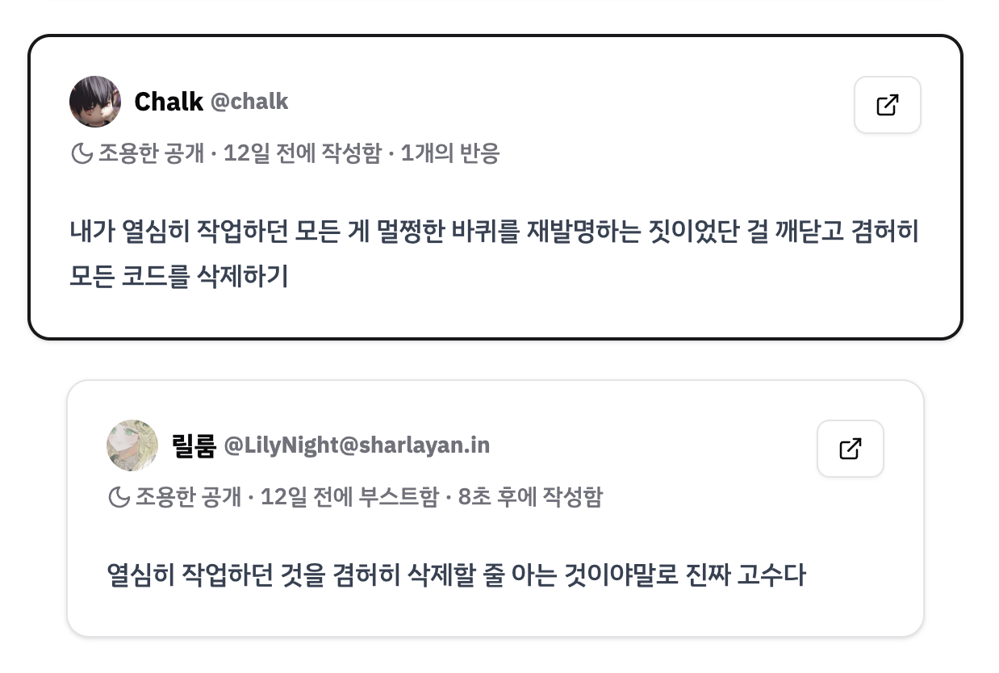

# decelerator

내 글을 부스트한 사람의 글을 모아주는 서비스



## 시작하기

```bash
docker compose up --build
```

- http://localhost:8234 페이지에서 서비스를 확인할 수 있습니다.

## 로컬 개발 환경

### 요구사항

- [nvm](https://github.com/nvm-sh/nvm)
- [Docker](https://www.docker.com)
- [Temporal CLI](https://docs.temporal.io/cli/setup-cli)

### 설치 및 실행

#### 설치

```bash
git clone https://github.com/chalkpe/decelerator.git
cd decelerator

nvm use
pnpm install
pnpm run build
```

#### 데이터베이스 준비

```bash
docker run --name postgres -p 5432:5432 -e POSTGRES_HOST_AUTH_METHOD=trust -d --rm postgres:17
pnpm -F @decelerator/database run push
```

- 데이터베이스 리셋이 필요한 경우 `--force-reset` 플래그를 추가해 다시 push 스크립트를 실행할 수 있습니다.

#### Temporal 서버 준비

```bash
temporal server start-dev
```

- Temporal 프로세스를 종료하지 마세요.

#### .env 파일 설정

기본 설정을 복사하여 사용합니다.

```bash
cp packages/database/.env.example packages/database/.env
cp packages/website/.env.example packages/website/.env
cp packages/worker/.env.example packages/worker/.env
```

### 서비스 시작

```bash
pnpm run dev
```

- http://localhost:8234 페이지에서 서비스를 확인할 수 있습니다.
- http://localhost:8233 페이지에서 Temporal UI를, http://localhost:5555 페이지에서 Prisma Studio를 확인할 수 있습니다.

### Misskey 로그인 문제 해결

기본적으로 로컬 개발 서버는 외부에서 접근할 수 없기 때문에 Misskey 서버에 로그인하려고 하면 `Failed to fetch client information` 오류가 발생합니다.

로컬 환경에서 Misskey 계정으로 로그인하려면, 해당 Misskey 서버에서 로컬 개발 서버에 `VITE_REDIRECT_URL`을 통해 접근할 수 있어야 합니다. [ngrok](https://ngrok.com) 등을 사용하여 로컬 서버를 외부에 개방할 수 있습니다.

아래 명령어로 ngrok을 실행하고 포워딩 URL을 복사합니다.

```bash
ngrok http 8234
```

ngrok 프로세스를 끄지 말고 아래 명령어로 개발 서버를 실행합니다. `VITE_REDIRECT_URL` 환경 변수를 복사한 URL로 변경하세요.

```bash
__VITE_ADDITIONAL_SERVER_ALLOWED_HOSTS=.ngrok-free.app VITE_REDIRECT_URL=https://************.ngrok-free.app pnpm run dev
```

## 라이선스

[MIT License](LICENSE)
